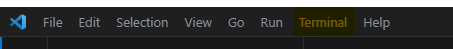
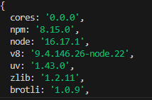
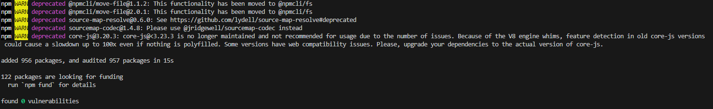
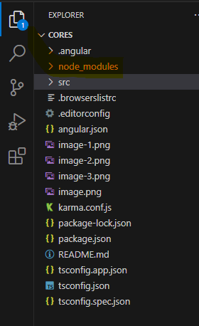
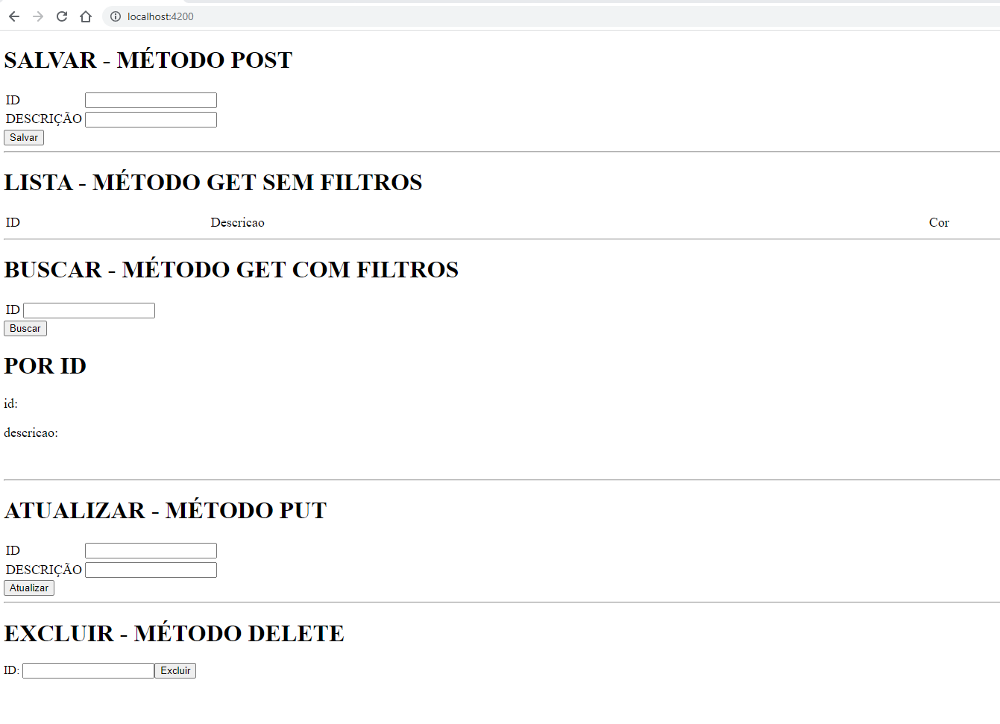

## Instalar componentes necessários
 
 VSCode:    https://code.visualstudio.com/sha/download?build=stable&os=win32-x64-user

 Node:      https://nodejs.org/dist/v16.17.1/win-x64/node.exe

## Efetuar teste para garantir que componentes foram instalados com sucesso
1. Abrir aplicação Visual Studio Code
2. Clicar no menu Terminal e clicar em "New Terminal" 
    
    
    Ou pressionar, ao mesmo tempo, nas teclas CTRL + SHIFT + ç
3. No terminal, digitar "npm version" e verificar se aparece o seguinte resultado:
    
4. Caso não apareça a imagem acima deverá ser verificado o processo de instalação do Node

## Efetudando download das dependências necessárias
Para que a aplicação possa executar é necessário executar os passos abaixo:

1. Com o Visual Studio Code aberto e o terminal aberto, digitar "npm install"
2. Aguardar que o download seja concluido.

    
3. Validar que, do lado esquerdo da tela, no icone "Explorer (Ctrl+Shift+E)" aparece o folder "node_modules".

    

## Executando a aplicação
Escreva, no terminal (pressionar, ao mesmo tempo, teclas CTRL + SHIFT + ç),  `ng serve` e pressionar tecla ENTER.

## Visualizando a aplicação
Abrir navegador (Chrome, Edge, etc) e escrever na barra de endereço (URL) http://localhost:4200/ e pressionar tecla ENTER

Estando tudo correto a tela abaixo deverá ser exibida:

